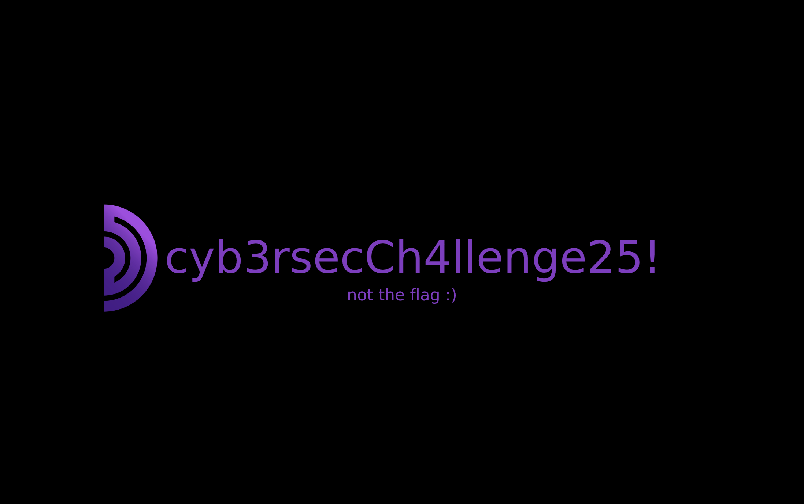
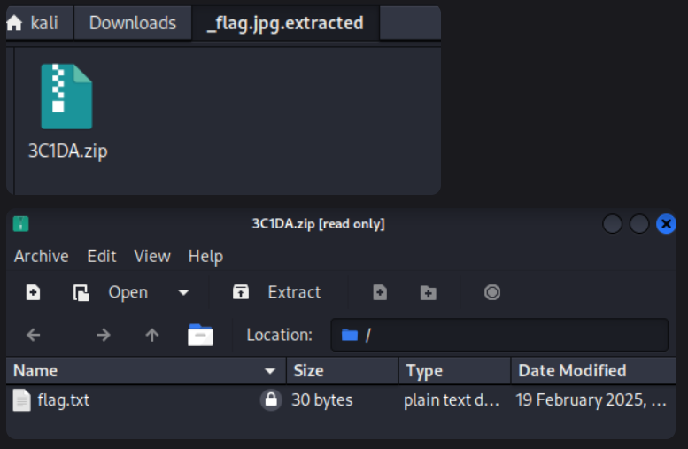

# Zipception

500 Points

The flag is hidden in a zip file. But we dont have the password. So we try to brute force it.

```bash
fcrackzip -u -v -D -p /usr/share/wordlists/rockyou.txt zipception.zip


found file 'flag.jpg', (size cp/uc 164023/246426, flags 1, chk 7ec4)
PASSWORD FOUND!!!!: pw == mitch123
```



`cyb3rsecCh4llenge25!`

but this is not the flag

```bash
binwalk -e flag.jpg
```



so the password for this zip was `cyb3rsecCh4llenge25!`

flag:
`CSC25{p4ssw0rd_1n_Th3_1m4ge}`
